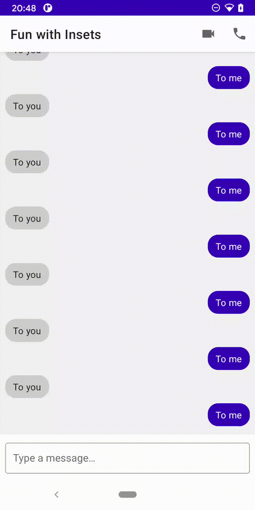

## Android 11 の新機能

Android 11 に追加される新機能で関係が深そうな機能を紹介します。
主に、[Features and APIs Overview](https://developer.android.com/preview/features) からピックアップしていますが他にもありましたらコメントお願いします。

※preview4 時点の情報のため変更される可能性があります

### コミュニケーションアプリ向けの機能改善

LINE などの2者間以上でのコミュニケーションのためのアプリ用に以下のような機能が改善されました。

* 通知を長押しでショートカット生成やサイレント、スヌーズ設定などの設定が可能になる
* 通知の style にアバター用のアイコンが強調されるようになる
* Android 10 で実験的機能として紹介された [Bubbles](https://developer.android.com/guide/topics/ui/bubbles)が利用可能になる

**TODO:画像** 

Bubbles を利用するとアプリを起動しなくてもコミュニケーションが可能になります。
コミュニケーションがメインのアプリだけでなく、BOTなどのやりとりがあるアプリでも使えそうです。

### One-time permission

位置情報、マイク、カメラに関する権限をリクエストすると「今回のみ」という選択肢が選べるようになります。
この選択肢を選ぶとアプリがバックグラウンドに遷移するか終了してから一定時間経過するまで機能にアクセスすることが可能になります。
この期間を経過すると、ユーザが再度権限を許可しない限り機能にアクセスできなくなります。

**TODO:画像**

https://developer.android.com/privacy/best-practices#permissions に従って実装されていれば、
この変更によってアプリの実装を変える必要はありません。

### IME の操作

IME の表示、非表示はシステム任せだったため、
表示、非表示時のコンテンツのサイズ変更がカクついて見えたり、IME の表示、非表示アニメーションはアプリ側では変更することができませんでした。
Android 11 からはアプリ側である程度ハンドリングできるようになり、IMEの表示、非表示アニメーションとコンテンツのサイズ変更が同時に行えるようになりカクつきをなくせたり、スクロール操作などで IME を表示、非表示させられるようになります。

| before | after |
| - | - |
|  |  |

### 複数のアプリでサイズの大きいデータをセキュアに共通で扱えるようになる

機械学習やメディア再生など複数のアプリでサイズの大きいデータを共有したいケースがある場合、
Android 10 以前ではアプリごとのデータのダウンロード、キャッシュなどを行う必要がありました。
Android 11 では、複数のアプリでデータを共有することが可能で、且つ、そのデータはセキュアに管理することができます。
この機能を利用することで通信量とストレージサイズを節約することが可能になります。

### 色々なディスプレイのサポート

[HUAWEI Mate 30 Pro](https://consumer.huawei.com/jp/phones/mate30-pro-5g/) のような曲面ディスプレイを持った端末や [Galaxy Fold](https://www.galaxymobile.jp/galaxy-fold/) のような折りたたみができる端末に対応するための API が追加されます。

デフォルトでは曲面部分に描画されないですが、新たに追加された設定値を利用すれば曲面部分に描画できるようになります。ただし、ボタンなどのユーザが操作するような `View` は曲面部分に描画されないように対応する必要があります。

折りたたみ端末は折りたたみ中の角度、状態を取得することが可能になります。
これによって特定の端末の折りたたみの状態時にアニメーションを実行するなどが可能になります。

### HEIF のサポート強化

Android 10 まででは HEIF 画像は静止画として表示することしかできなかったがアニメーションとして表示できるようになります。
JPEG や GIF よりもファイルサイズを削減できるので、アプリサイズや通信量の節約ができそうです。

ただ、対象の API は Android 9 からでしか使えませんし、Android 10 以下の端末だとアニメーションしないので、今のところ使いどころはあまりないかなとは思います。

### ワイヤレスでデバッグが可能に

PC と端末を優先で接続しなくてもデバッグがワイヤレス通信で可能になります。

複数の端末に同時にアプリをインストールすることも可能なので、複数端末で動作確認を行う際は楽になりそうです。

※ preview だからなのか、ネットワーク環境の問題なのかは不明ですが、ペアリングはできるもののアプリのインストールができませんでした。

### アプリプロセスの終了理由の取得

アプリプロセスの終了理由を取得できるようになります。
次回のアプリ起動時に前回の終了理由を取得し送信などすることでクラッシュ理由を特定し、アプリを改善することが容易になります。

終了日時やスタックトレースの他に開発者が設定した情報も次回のアプリ起動時に取得できるようになります。
再現頻度の低い不具合だとログが取れなかったりすると余計な時間がかかってしまいます。
アプリに前回の終了理由の取得、送信する機能を持たせることで QA が楽になりそうです。

--- 以下は詳細について未確認なので記載するかどうか悩む ---

### システムのサービスにアプリのデータを共有することが可能になる

アプリで利用しているデータをシステムに共有することでユーザのコンテキストに沿った情報を端末が提供できるようになります。例えば、アプリが駅や空港の近くにいるという情報を共有することで関連する旅行情報などを表示してくれるようになります。

